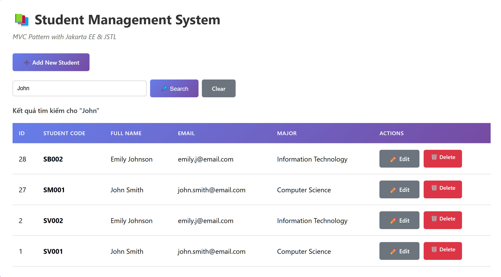
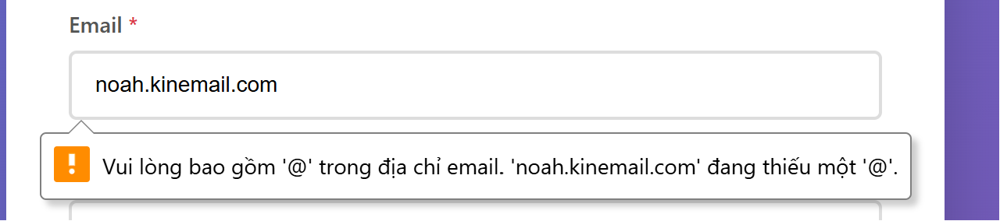

# Nguyễn Việt Thảo - ITCSIU23058 

# Web-Application-Development-Lab-05
LAB 5: SERVLET &amp; MVC PATTERN

Work Flow Explain:

# 1. Add

(1) User enters list page: student-list.jsp

→ student?action=list

(2) Select "➕ Add New Student"

→ URL changes to
student?action=new

(3) Controller (StudentController) reads action=new

→ calls showNewForm()
→ forward to JSP
/views/student-form.jsp

(4) User enters information → Submit → POST

Form sent to:
student?action=insert

(5) doPost() reads action=insert → calls insertStudent()

Get data from form → create Student newStudent → calls DAO

(6) DAO → addStudent() → INSERT into DB

INSERT INTO students (student_code, full_name, email, major) VALUES ...

(7) Success → redirect

response.sendRedirect("student?action=list&message=Student added successfully");

→ use redirect to avoid duplicate submission error (POST–Redirect–GET)

(8) View re-displays list + message

# 2. Edit

(1) User clicks Edit → URL:

student?action=edit&id=3

(2) Controller reads action=edit

→ calls showEditForm()

(3) DAO → getStudentById(id)

Get Student object from DB

(4) Controller setAttribute("student", data) → forward

→ student-form.jsp displays form with old data

→ Student Code is usually readonly

(5) User edits → submit → POST

student?action=update

(6) updateStudent()

Get data → set to Student → calls DAO

(7) DAO → updateStudent() → UPDATE
UPDATE students SET ... WHERE id = ?

(8) Redirect to list + message

student?action=list&message=Student updated successfully

(9) Display list + message

# 3. Delete 
(1) User click Delete → confirm → send request

student?action=delete&id=3

(2) Controller processing

→ call deleteStudent()

(3) DAO → deleteStudent(id)
DELETE FROM students WHERE id = ?

(4) Redirect to list (GET)

student?action=list&message=Student deleted successfully

(5) View displays the new list


=================================================================================
## Excersise 5 : SEARCH FUNCTION 

Main steps:
1. DAO: add `searchStudents(String keyword)` using `PreparedStatement` with 3 placeholders and `searchPattern = "%" + keyword + "%"`. <br>
2. Controller: in `listStudents()` read `request.getParameter("keyword")`; if there is a keyword, call `studentDAO.searchStudents(keyword)` and assign `request.setAttribute("keyword", keyword)`; otherwise call `getAllStudents()`. <br>
3. View (JSP): add GET form with `input name="keyword"` and escape the value with `<c:out>` to avoid XSS.

DAO:

```java
// StudentDAO.java
public List<Student> searchStudents(String keyword) {
    if (keyword == null || keyword.trim().isEmpty()) return getAllStudents();
    String sql = "SELECT id, student_code, full_name, email, major, created_at FROM students"
               + " WHERE student_code LIKE ? OR full_name LIKE ? OR email LIKE ? ORDER BY id DESC";
    String p = "%" + keyword + "%";
    // prepare, set p for placeholders, execute, map ResultSet -> List<Student>
}
```

Controller:

```java
// StudentController.java (trích đoạn)
String keyword = request.getParameter("keyword");
if (keyword != null && !keyword.trim().isEmpty()){
    students = studentDAO.searchStudents(keyword.trim());
    request.setAttribute("keyword", keyword.trim());
} else {
    students = studentDAO.getAllStudents();
}
```

student-list:

```jsp
 <!-- Search Form -->
        <div style="margin-bottom: 20px; display:flex; gap:10px; align-items:center;">
            <form action="student" method="get" style="display:flex; gap:8px; align-items:center;">
                <input type="hidden" name="action" value="list" />
          <input type="text" name="keyword" placeholder="Search by code, name or email" 
              value="<c:out value='${keyword}'/>" 
              style="padding:10px; border-radius:6px; border:1px solid #ccc; width:320px;" />
                <button type="submit" class="btn btn-primary">🔎 Search</button>
                <a href="student?action=list" class="btn btn-secondary">Clear</a>
            </form>
        </div>
```

# Output: 


<<<<<<< HEAD


=================================================================================
## EXERCISE 6: SERVER-SIDE VALIDATION 

(1) Controller (`StudentController.java`):<br>
- Add method `private boolean validateStudent(Student student, HttpServletRequest request)`.

- Check `studentCode`: required, normalize to UPPERCASE, must be correct pattern (2 letters + 3+ digits) — errors saved to `request.setAttribute("errorCode", "...")`.

- Check `fullName`: required, length >= 2 — errors saved to `errorName`.

- Check `email`: if entered, must be correct simple format (regex) — errors saved to `errorEmail`.

- Check `major`: required — errors saved to `errorMajor`.

- Call `validateStudent(...)` in `insertStudent(...)` and `updateStudent(...)` before calling DAO.

- If validation fails: reset `student` (to keep data), forward to form (`/views/student-form.jsp`) and stop (return).

- If valid: continue insert/update and redirect to list with success message.

(2) View (`student-form.jsp`):<br>
- Add error display next to each field 
(use `<c:if test="${not empty errorCode}">` ... );
style `.error { color:red; ... }`.<br>
- When form is forwarded due to error, fields will still keep entered values ​​(use `${student != null ? student.field : ''}`).

Controller - validateStudent():

```java
private boolean validateStudent(Student student, HttpServletRequest request) {
    boolean isValid = true;

    String code = student.getStudentCode();
    if (code != null) code = code.trim();
    if (code == null || code.isEmpty()) {
        request.setAttribute("errorCode", "Student code is required");
        isValid = false;
    } else {
        String normalized = code.toUpperCase();
        student.setStudentCode(normalized);
        if (!normalized.matches("[A-Z]{2}\\d{3,}")) {
            request.setAttribute("errorCode", "Invalid format. Use 2 letters + 3+ digits (e.g., SV001)");
            isValid = false;
        }
    }

    // fullName, email, major checks (đặt errorName, errorEmail, errorMajor)
    return isValid;
}
```

Controller - use validate in insert:

```java
Student newStudent = new Student(studentCode, fullName, email, major);
if (!validateStudent(newStudent, request)) {
    request.setAttribute("student", newStudent);
    RequestDispatcher dispatcher = request.getRequestDispatcher("/views/student-form.jsp");
    dispatcher.forward(request, response);
    return;
}
// if validated -> call DAO and redirect
```

JSP - show error:

```jsp
<input type="text" id="studentCode" name="studentCode" value="${student != null ? student.studentCode : ''}" />
<c:if test="${not empty errorCode}">
    <span class="error"><c:out value="${errorCode}"/></span>
</c:if>
```

# Output: 

=================================================================================
## EXERCISE 7: SORTING & FILTERING
